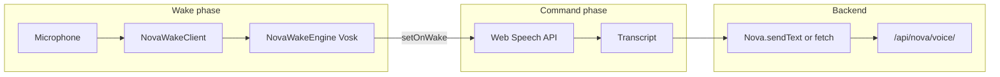

# Nova Wake Word, Static Assets, Nginx, and Deployment — Runbook

This document records **architecture**, **failure modes we hit**, **fixes applied**, and **operational steps** so the same problems do not recur. It complements the shorter checklist in [`deploy_checklist_nginx_uvicorn_static_audio.md`](./deploy_checklist_nginx_uvicorn_static_audio.md).

---

## 1. Purpose and scope

- **Wake word path:** Browser loads Vosk (small English model tarball), streams microphone audio through `NovaWakeClient`, and uses `NovaWakeEngine` to detect “nova” / “hey nova”. After wake, the **Web Speech API** captures **one** command utterance and the transcript is sent to Nova (via `Nova.sendText` or a direct POST to `/api/nova/voice/`).
- **Static / nginx:** Collected assets under `staticfiles/` (and runtime audio under `static/nova_audio/`) must be reachable by nginx as `www-data` without path or permission mistakes.
- **Django / templates:** Changes to `templates/` require an app process restart; changes to `static/js/*` require `collectstatic` (and nginx reload when nginx only reads `staticfiles/`).

---

## 2. Architecture (end-to-end)



**Important split:** Wake detection is **Vosk in the browser** (not the server). Command capture is **Web Speech** (Chrome/Edge/Safari behavior varies). The server does not see raw wake audio for the Vosk path.

---

## 3. Script load order (dashboard)

Defined in `templates/dashboard/dashboard.html` (deferred scripts, order matters):

1. `vosk.js` — Vosk runtime.
2. `nova_stream.js` — defines `NovaStreamClient` (optional); `nova_wake_client.js` uses `NovaStreamClient._downsampleToInt16` when present, else its own downsample path.
3. `nova_wake_vosk.js` — `NovaWakeEngine` wrapper (model load, phrase matching).
4. `nova_wake_client.js` — `NovaWakeClient` (`getUserMedia`, graph, PCM to engine).
5. `nova_console_panel.js` — console UI (independent).
6. **`nova_wake.js`** — UI button, ties Vosk wake → Web Speech command → `sendToNova`.
7. `nova.js` — voice panel integration (`Nova.sendText`, audio playback hooks).

**Removed from this list (by design):** `nova_wake_levels.js` — was a second `getUserMedia` stream for energy-based end-of-command. It caused **race conditions** with Web Speech (finalize before any transcript) and duplicated mic usage. Post-wake behavior now relies on **`SpeechRecognition.continuous = false`** (browser end-of-utterance). The file may still exist under `static/js/` but is **not** loaded on the dashboard.

---

## 4. Key source files and responsibilities

| Area | Path | Role |
|------|------|------|
| Wake UI + orchestration | `static/js/nova_wake.js` | Button, Vosk init, `startSpeechCapture()`, fallback loop, `sendToNova()`. |
| Mic → Vosk | `static/js/nova_wake_client.js` | `getUserMedia`, AudioWorklet/graph, resample to 16 kHz, `NovaWakeEngine.process`. |
| Vosk wrapper | `static/js/nova_wake_vosk.js` | Model fetch/unpack, `setOnWake`, phrase logic. |
| Optional level helper (unused in prod UI) | `static/js/nova_wake_levels.js` | Energy-based silence (not wired in template). |
| Model asset | `static/vosk/model-en/vosk-model-small-en-us-0.15.tar.gz` (served as static) | Downloaded by the worker in `nova_wake_vosk.js`. |
| Nginx v7 reference | `deploy/nginx-site-mission_control-v7-static-alias.conf` | Correct `alias` for `/static/` without broken `try_files`. |
| Deploy steps | `theDocs/deploy_checklist_nginx_uvicorn_static_audio.md` | Commands for collectstatic, nginx, uvicorn. |

**Mission dashboard widgets (same project era):** Models and views for income / pipeline / daily build / IoT lab panels live under `dashboard/` (e.g. migration `0003_mission_widgets_income_build_iot.py`, related services and templates). They are unrelated to wake word logic but share the same deploy cycle (collectstatic + restart when templates or static change).

---

## 5. Issue registry (symptom → root cause → fix)

### 5.1 Static JS/CSS return **404** though files exist in `staticfiles/`

- **Cause:** Using `try_files $uri =404` inside a `location` that uses **`alias`** for `/static/`. Nginx resolves paths incorrectly and everything under `/static/` 404s.
- **Fix:** Use the v7-style config: **`alias` only**, no `try_files` in those blocks. Copy from `deploy/nginx-site-mission_control-v7-static-alias.conf` and `nginx -t` + reload.
- **Reference:** Checklist §8.

### 5.2 Static assets return **403 Forbidden**

- **Cause:** nginx runs as **`www-data`**. The path to `staticfiles/` includes directories such as `/home/pock/.openclaw`. If `/home/pock/.openclaw` is mode **`700`**, other users cannot traverse the directory even if the file mode on `staticfiles/` is world-readable.
- **Fix:** Allow execute (traverse) on the path for others, e.g. `chmod o+x /home/pock/.openclaw`, or use ACLs for `www-data` only.
- **Verify:** `sudo -u www-data test -r /path/to/staticfiles/css/cyber.css && echo OK`
- **Reference:** Checklist §7.

### 5.3 Vosk model fetch fails or browser uses a **cached bad response**

- **Symptom:** Wake never becomes “ready”, console shows fetch/worker errors, or a previous 404/403 is cached.
- **Mitigations:** Ensure §5.1 and §5.2 are fixed; bump a **query string** on the model URL in `nova_wake.js` (`modelPath` … `tar.gz?v=…`) when you need to bust caches after fixing the server.
- **Operational:** After changing `nova_wake.js`, run **collectstatic** and restart/reload as per checklist.

### 5.4 Wake word insensitive or mic fails to start

- **Cause:** `echoCancellation` / `noiseSuppression` **on** can attenuate the wake stream enough that Vosk rarely fires.
- **Fix (wake client):** `nova_wake_client.js` uses **`echoCancellation: false`** and **`noiseSuppression: false`** for the wake stream. Do not “help” by re-enabling DSP without retesting wake accuracy.
- **Cause:** `getUserMedia` rejection (permission, device busy). Ensure `.catch` / user messaging exists; `NovaWakeEngine.init` / `wakeClient.start()` ordering must set `_running` (or equivalent) **before** audio graph connection where that was a past bug — see git history on `nova_wake_client.js` / `nova_wake_vosk.js` if regressions appear.

### 5.5 Post-wake command **never sent** or **empty** (historical)

Several distinct causes appeared over time:

1. **Custom silence timer + normalized dedupe:** Timer not armed when Chrome repeated interim results with the same normalized string; or timer fought with `recognition.onend` restart logic in **continuous** mode.
2. **`WakeCommandLevelMonitor`:** A **second** microphone stream called `finalizeSpeechCapture()` after ~2 s of **mic** silence **before** Web Speech produced any transcript → `speechFinalized` was set, recognition stopped, **`lastFullText` empty** → nothing sent to Nova.
3. **Mitigation that was later replaced:** Gating level-monitor finalize on non-empty text, raw-string timer rearm, `COMMAND_SILENCE_MS` tuning.
4. **Current design (intentional):** Removed custom silence timers and removed `nova_wake_levels.js` from the template. Post-wake capture uses **`recognition.continuous = false`** and **`recognition.interimResults = true`**; **`onend`** runs **`finalizeSpeechCapture()`** so **endpointing matches the browser**. A **30 s** `MAX_COMMAND_CAPTURE_MS` timer remains only as a safety net.

**Tradeoff:** Long pauses **in the middle** of one spoken command may end the session early (browser decides utterance ended). That is accepted in exchange for predictable, native silence behavior.

### 5.6 No-Vosk fallback path

- If Vosk fails to init, `nova_wake.js` uses **`useSpeechFallback()`**: repeated **non-continuous** `SpeechRecognition` sessions. Each session ends on browser utterance boundaries; if the transcript contains “nova”, the suffix after the wake phrase is extracted (`extractAfterWake`) and sent.

---

## 6. Operational discipline (after every change)

**Rule of thumb:**

| Change | Action |
|--------|--------|
| `static/js`, `static/css`, images | `python manage.py collectstatic --noinput` |
| Templates (`templates/`), Python, settings | `sudo systemctl restart uvicorn-django-nova-asgi.service` |
| Nginx site file | `sudo nginx -t` && `sudo systemctl reload nginx` |

A typical UI + template edit needs **collectstatic + uvicorn restart + nginx reload** so browsers and workers never serve stale bundles from an old `staticfiles/` tree.

Full commands and health checks: [`deploy_checklist_nginx_uvicorn_static_audio.md`](./deploy_checklist_nginx_uvicorn_static_audio.md).

---

## 7. Debugging playbook

### 7.1 Wake / command in the browser

1. Open DevTools **Console**: look for `[Wake]` logs, Vosk init errors, `getUserMedia` errors.
2. **Network:** Confirm `GET` to the Vosk tarball URL returns **200** and full content length (not cached 404/403).
3. **Network:** After speaking, confirm **POST** `/api/nova/voice/` (or whatever `Nova.sendText` uses) fires with the expected body.

### 7.2 Static from the server shell

```bash
curl -I "https://<your-host>/static/js/nova_wake.js"
curl -I "https://<your-host>/static/vosk/model-en/vosk-model-small-en-us-0.15.tar.gz"
```

### 7.3 Permissions

```bash
namei -l /home/pock/.openclaw/workspace/mission_control/staticfiles/js/nova_wake.js
sudo -u www-data test -r /home/pock/.openclaw/workspace/mission_control/staticfiles/js/nova_wake.js && echo OK
```

---

## 8. Anti-patterns (do not reintroduce without re-reading this doc)

1. **`try_files` + `alias`** for `/static/` — predictable 404s.
2. **Home directory `700`** on any path component nginx must traverse — predictable 403s.
3. **Second `getUserMedia` for “silence detection”** in parallel with Web Speech **without** proving it cannot finalize before STT text exists — caused empty sends.
4. **Custom silence timers** fighting **`continuous: true` + `onend` restart** — fragile; prefer **`continuous: false`** for post-wake command if you want browser-native cutoff.
5. **Shipping JS changes without `collectstatic`** when production serves `staticfiles/` — users stay on old behavior until deploy step runs.
6. **Editing `templates/dashboard/dashboard.html` script order** casually — `nova_wake.js` must run after `nova_wake_vosk.js` and `nova_wake_client.js`.

---

## 9. Constants worth knowing (`nova_wake.js`)

- **`MAX_COMMAND_CAPTURE_MS`:** `30000` — forces finalize if `onend` never arrives (stuck session).
- **`modelPath` query `?v=wake…`:** Bump when forcing clients to refetch the tarball after server/cache fixes.

---

## 10. Revision history (documentation)

| Date (approx) | Notes |
|---------------|--------|
| 2026-03-27–29 | Document created: consolidates nginx static 403/404, Vosk model/mic, post-wake STT evolution, removal of `nova_wake_levels` from dashboard, browser-native `continuous: false` command capture, deploy checklist cross-links. |

When you change wake behavior or static/nginx layout again, append a row here and update the relevant sections above.
